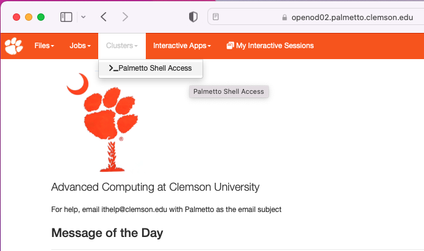
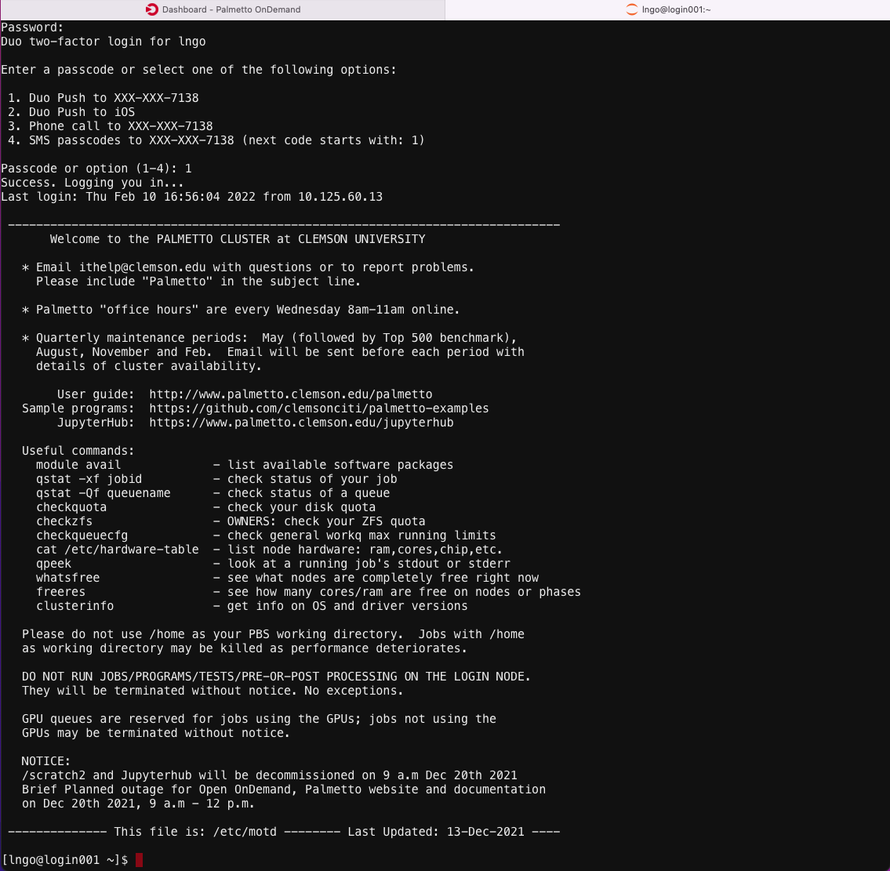
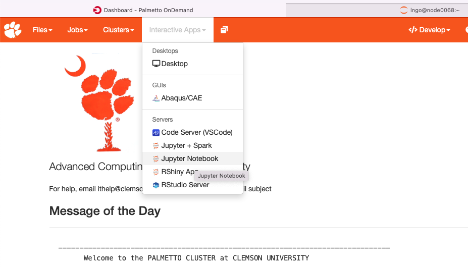
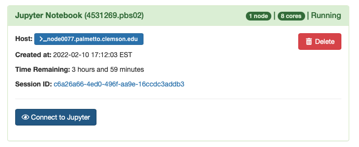
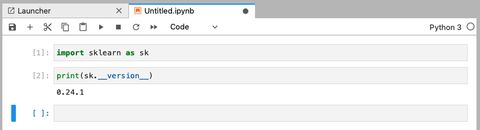

We will use Palmetto cluster for this workshop with Jupyter Lab.

Please follow this guideline to create a new conda environment and install scikit-learn package.
Log into [Clemson's OpenOnDemand](https://openod02.palmetto.clemson.edu/)


Under `Clusters` select `Palmetto Shell Access`



Log into the Palmetto Command Line Shell



Run the following `qsub` command

```bash
$ qsub -I -l select=1:ncpus=8:mem=15gb:interconnect=1g,walltime=24:00:00
```

Next, run the following commands. 

```bash
$ module load anaconda3/2021.05-gcc/8.3.1
$ conda create -n skln python=3.8 -y
$ source activate skln
$ conda install numpy pandas scikit-learn seaborn matplotlib jupyterlab -y
```

=> Note: while using **skln** conda environment, if we are missing anything, we can always come back and update using **pip install**
or **conda install** method.

Go back to OpenOnDemand Dashboard, under `Interactive Apps` select `Jupyter Notebook`



Make the selection on the Jupyter Notebook App as follows:

- `Anaconda Version`: `anaconda3/2021.05-gcc/8.3.1`
- `Path to Python virtual/conda environment`: `source activate skln`
- `Notebook Workflow`: `Standard Jupyter Notebook`
- `Number of resource chunks (select)`: `1`
- `CPU cores per chunk (ncpus)`: `8`
- `Amount of memory per chunk (mem)`: `15gb`
- `Interconnect`: `1g - Ethernet older phases 1-6`
- `Walltime`: `04:00:00`

Click `Launch`. 

Click `Connect to Jupyter` once the job is ready. 



Open a new notebook using the default `Python 3` kernel. Test for the valid installation of `scikit-learn`. 





